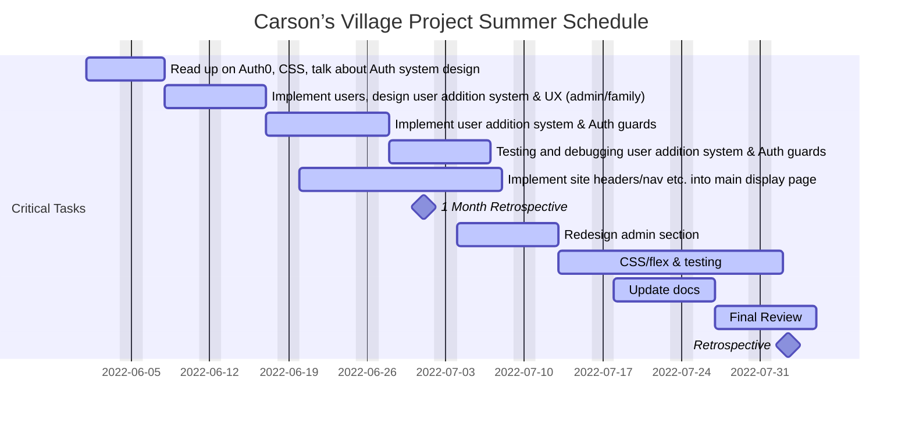

<!-- Headings -->
# Heading 1
## Heading 2
### Heading 3
#### Heading 4
##### Heading 5
###### Heading 6

<!-- Italics -->
*This text* is italic
_This text_ is italic

<!-- Strong Text -->
**This text** is strong
__This text__ is strong

<!-- Strike Through -->
~~This text~~ is strikethrough

<!-- Horizontal Rule -->
---
___

<!-- Block Quotes -->
>This is a quote

<!-- Links -->
[Text we want to use](https://carsonsvillage.org/)

[Text with tooltip](https://carsonsvillage.org/ "Carson's Village")

<!-- Unordered List -->
* Item 1
* Item 2
* Item 3
    * Nested Item 1
    * Nested Item 2

<!-- Ordered List -->
1. Item 1
1. Item 2
1. Item 3
    
<!-- Inline Code Block -->
`<p>This is a paragraph</p>`

<!-- Images -->


<!-- Github Markdown -->

<!-- 
    Code Blocks 
    you can specify syntax specific  
-->
```bash
    npm install
    
    npm start
```

```javascript
    function add(num1, num2){
        return num1 + num2
    }
```

```python
    def add(num1, num2):
        return num1 + num2
```

<!-- Tables -->
|Name    |Email         |
|--------|--------------|
|John Doe|john@gmail.com|
|Jane Doe|jane@gmail.com|

<!-- Task Lists -->
* [x] Task 1
* [x] Task 2
* [ ] Task 3

